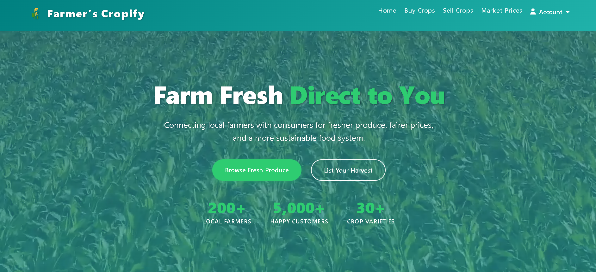
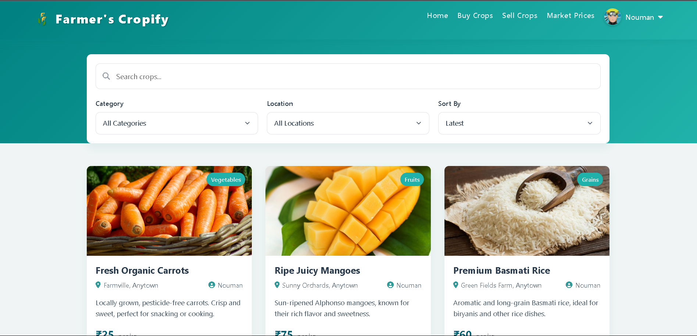
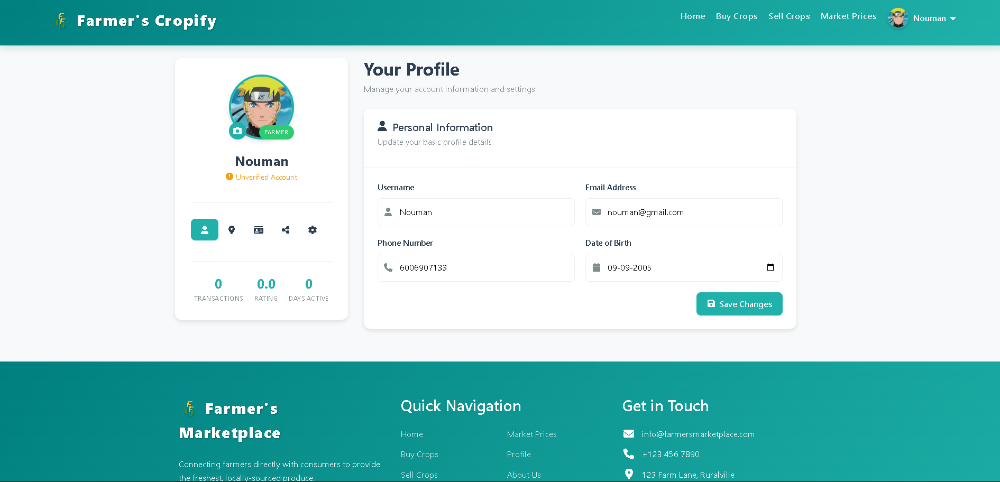
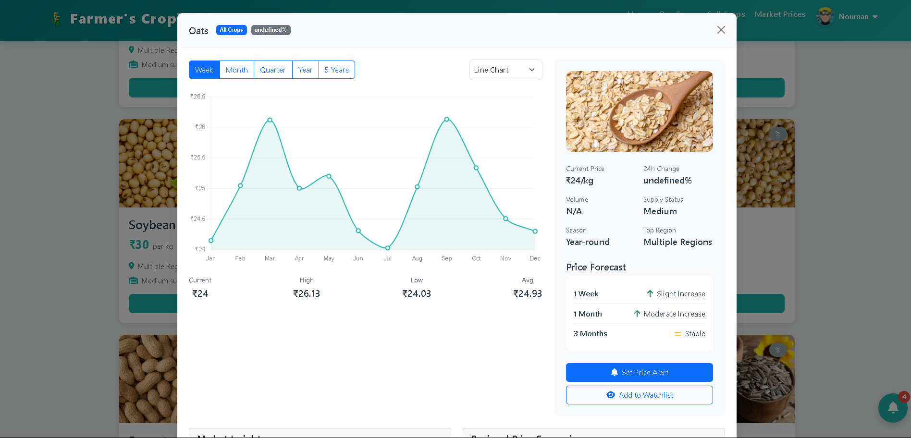

# 🌱 Cropify – Empowering Farmers | Google Solution Challenge 2025 🚀

Cropify is a farmer's marketplace built for the **Google Solution Challenge 2025**. It enables **direct trading between farmers and consumers**, cutting out middlemen to ensure fair prices, transparency, and accessibility in agriculture.



---

## 📌 Table of Contents

- [🌟 Features](#-features)
- [📸 Project Screenshots](#-project-screenshots)
- [🚀 Tech Stack](#-tech-stack)
- [⚙️ Project Setup](#️-project-setup)
- [📄 License](#-license)

---

## 🌟 Features

- 👨‍🌾 Farmer Registration and Login (with Passport.js)
- 🌾 Add and Buy Crops with Image Upload
- 📊 Real-time Market Prices
- 📍 KYC Verification and Profile Management
- 📋 Dashboard for Users and Admins
- 🛡️ Secure Sessions and Middleware
- 🗺️ Clean EJS Templating with Bootstrap UI

---

## 📸 Project Screenshots

### 🏡 Buy Crops  


### 📋 Profile  


### 🌾 AI Market Listings  


---

## 🚀 Tech Stack

| Technology      | Used For                        |
|------------------|----------------------------------|
| Node.js          | Backend Runtime                 |
| Express.js       | Routing & Middleware            |
| MongoDB          | Database                        |
| EJS              | Templating                      |
| Passport.js      | Authentication                  |
| Bootstrap        | Responsive Styling              |
| Multer           | Image Uploads                   |
| Mongoose         | MongoDB ODM                     |
| Chart.js         | Market Price Charts             |

---

## ⚙️️ Project Setup

### 1. Clone the repo

```bash
git clone https://github.com/Nouman-wp/Cropify.git
cd cropify
```

### 2. Install Dependencies

```bash
npm install
```

### 3. Environment Variables

Create a `.env` file in the root directory:

```
MONGO_URL=your_mongodb_url
SESSION_SECRET=your_secret_key
```

### 4. Run the app

```bash
npm start
```

Visit: `http://localhost:3000`


---

## 🤝 Contributing

Contributions are welcome! Here's how:

1. Fork the project
2. Create your branch: `git checkout -b feature-name`
3. Commit changes: `git commit -m "added new feature"`
4. Push to your branch: `git push origin feature-name`
5. Submit a pull request

---

## 📄 License

This project is licensed under the [MIT License](LICENSE).

---

